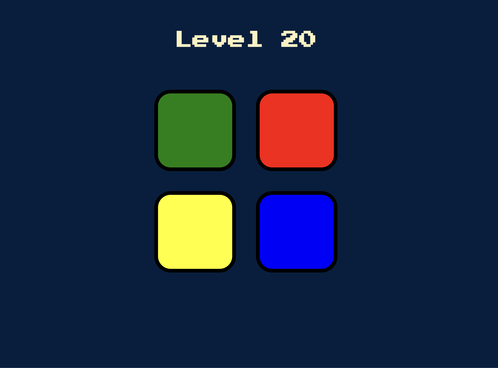

# Color Memory Game: <a href="https://66b09fa20e9243afeeefd5a2--venerable-manatee-773063.netlify.app/" target="_blank">Visit Here</a>

Welcome to the Color Memory Game, where you test your memory by following an increasingly complex pattern of flashing lights and sounds. Think you're sharp? Think again! With colors playing mind games, your brain will feel like it's run a marathon. It's like a dance-off with a disco ball, but the disco ball always wins. Get ready to curse colors you've never cursed before!

## Tech used: 

## How to play:
1. Press any key to start.
2. Watch the sequence of flashing colors and sounds.
3. Click the buttons in the same order.
4. Each level adds a new flash to the sequence.
5. If you mess up, press any key to restart.
Good luck!

## Optimizations

<li>Prevent accidental multiple clicks by adding a debounce function to the button click handlers.</li>
<li>Save and display the highest level achieved.</li>
<li>Add easy, medium, and hard modes with varying speeds and sequences.</li>
<li>Optimize the game interface and interactions for mobile devices.</li>

## Lessons Learned:

<li>Regular testing during development helps catch and fix bugs early.</li>
<li>Leveraging jQuery’s cross-browser capabilities simplifies DOM manipulation and event handling.</li>
<li>Learning to incorporate sound effects enhances user engagement and experience.</li>
<li>Understanding how to seamlessly integrate CSS with JavaScript/jQuery for dynamic styling.</li>
